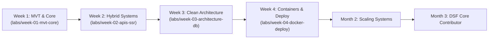
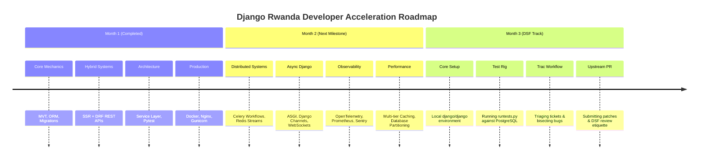

# Django Rwanda — 30-Day Developer Acceleration Track
### Educational Monorepo: From Web Fundamentals to Containerized Deployment

[](https://docs.djangoproject.com/) [](https://www.python.org/) [](https://www.postgresql.org/) [](https://www.docker.com/) [](LICENSE) [](https://github.com/django-rwanda)


---

## 1. Vision & Architecture Overview

The **Django Rwanda 30-Day Developer Acceleration Track** is an open-source educational monorepo engineered to bridge aspiring and mid-level software engineers to global engineering and **Django Software Foundation (DSF)** open-source contribution standards.

### Core Philosophy
1. **Zero Fluff & Anti-Burnout**: Avoid dense theoretical essays. Learn via isolated, incremental hands-on workspaces and official DSF documentation links (`docs.djangoproject.com`).
2. **Issue-Driven Learning Progression**: The repository functions like a live open-source project. Learners pick GitHub Issues, create scoped feature branches, build in isolated lab folders, and open Pull Requests.
3. **Zero Root-Coupling**: Unlike a monolithic single-app repository, each weekly lab is completely self-contained with its own `starter/` workspace and automated `tests/` suite. Multiple participants can work simultaneously on different weeks without triggering schema, model, or migration merge conflicts.
4. **Scaffolding for Seniority**: Designed as Month 1 of a 3-part progression into Month 2 (Senior Backend Systems & Scale) and Month 3 (Contributing to Django Core / DSF).

### Target Audience & Prerequisites
- **Python Mechanics**: Working knowledge of Python 3.10+ (OOP, functions, decorators, type hints, virtual environments).
- **Git & Terminal Fluency**: Basic CLI navigation, POSIX terminal commands, Git branching, and GitHub Pull Request workflows.
- **Relational Databases**: Fundamental understanding of tables, rows, primary/foreign keys, and relational data.

---

## 2. Educational Monorepo Directory Architecture

The repository avoids a shared root Django application. Instead, it utilizes an **Educational Workspace / Monorepo Pattern** where each milestone has an isolated starter environment and dedicated automated evaluation tests:

```text
django-core-track/
├── .github/
│   ├── ISSUE_TEMPLATE/
│   │   ├── lab-task.md           # Template for weekly curriculum milestone issues
│   │   └── bug-fix.md            # Template for tracking repository bugs or typos
│   └── workflows/
│       └── lint-and-test.yml     # Scoped CI running linters and tests for modified labs
├── docs/
│   ├── milestones/               # Architectural reference guides & deep-dive notes
│   │   ├── week-01-mvt.md
│   │   ├── week-02-apis-ssr.md
│   │   ├── week-03-architecture.md
│   │   └── week-04-devops.md
│   └── IMPLEMENTATION_PLAN.md    # Master curriculum sprint plan & GitHub issue backlog
├── labs/
│   ├── week-01-mvt-core/
│   │   ├── starter/              # <-- Learner builds here (untracked state / clean slate)
│   │   │   ├── manage.py
│   │   │   ├── core/
│   │   │   └── events/
│   │   └── tests/                # <-- CI test harness validating Week 1 deliverables
│   │       ├── conftest.py
│   │       └── test_lab_01.py
│   ├── week-02-apis-ssr/
│   │   ├── starter/              # <-- Learner builds hybrid SSR + DRF platform
│   │   └── tests/                # <-- Test suite validating views, serializers & auth
│   ├── week-03-architecture-db/
│   │   ├── starter/              # <-- Learner implements Service/Selector layer
│   │   └── tests/                # <-- Concurrency & race condition validation tests
│   └── week-04-docker-deploy/
│       ├── starter/              # <-- Learner containerizes Django, Nginx, Gunicorn
│       └── tests/                # <-- Container smoke tests & compose validation
├── CONTRIBUTING.md               # Issue claiming, branch naming & PR review rules
├── Makefile                      # Standardized targets scoped per lab
├── pyproject.toml                # Unified Ruff, Mypy, and Pytest configuration
├── requirements-dev.txt          # Shared developer dependencies
└── README.md
```

---

## 3. Four-Week Curriculum Breakdown (Milestones)



---

### Week 1: Django Architecture & Core Mechanics
**Path**: `labs/week-01-mvt-core/`

#### Key Architectural Concepts
1. **MVT vs. Classic MVC**:
   - **Model**: Python representation of database tables, constraints, and business state invariants.
   - **View**: Request handler callable resolving HTTP request payloads into an HTTP response (analogous to the Controller in classic MVC).
   - **Template**: Presentation engine interpolating dynamic context into clean HTML (analogous to the View in classic MVC).
2. **Django Request-Response Lifecycle**:
   - Web server entrypoint: WSGI (`get_wsgi_application()`) and ASGI (`get_asgi_application()`).
   - The Middleware onion pipeline: `process_request`, `process_view`, `process_exception`, and `process_response`.
   - URL resolution: Path tree matching to view callables.
3. **ORM Mechanics & Query Optimization**:
   - **Lazy Evaluation**: QuerySets do not hit the database until evaluated (`list()`, `[0]`, `len()`, `for x in qs`).
   - **The N+1 Query Problem**: Looping over related foreign key records without eager loading triggers redundant round-trip queries.
   - **Fixes**: `select_related(*fields)` for single-valued relationships (SQL `JOIN`); `prefetch_related(*lookups)` for multi-valued sets (separate SQL `IN` query stitched in memory).
4. **Schema Migrations Engine**:
   - Migration operations dependency graph (`MIGRATE`), forward and backward execution, and resolving conflicting branches.

#### Hands-On Lab 01: Modular Community Event Directory
- **Location**: `labs/week-01-mvt-core/starter/`
- **Deliverable**:
  - Implement relational models: `Category`, `Organizer`, `Venue`, `Event`, and `Registration`.
  - Enforce integrity via `UniqueConstraint(fields=['slug', 'organizer'])` and `CheckConstraint(check=Q(end_time__gt=F('start_time')))`.
  - Customize Django Admin with list filters, searchable fields, inline registrations, and batch actions.
  - Optimize roster queries from 50+ database hits down to exactly 2 queries using `select_related` and `prefetch_related`.

#### Official DSF Documentation
- [Django Request-Response Life Cycle](https://docs.djangoproject.com/en/5.1/intro/tutorial01/)
- [Model Fields & Constraints](https://docs.djangoproject.com/en/5.1/ref/models/fields/)
- [QuerySet API Reference](https://docs.djangoproject.com/en/5.1/ref/models/querysets/)
- [Database Access Optimization](https://docs.djangoproject.com/en/5.1/topics/db/optimization/)
- [Migrations Architecture](https://docs.djangoproject.com/en/5.1/topics/migrations/)

---

### Week 2: Server-Side Rendering (SSR) & RESTful APIs
**Path**: `labs/week-02-apis-ssr/`

#### Key Architectural Concepts
1. **Server-Side Rendering (SSR)**:
   - Django Template Engine (DTE), context processors for global data injection, and custom template tags/filters.
   - Class-Based Views (CBVs): `ListView`, `DetailView`, and `CreateView` with automated form handling and CSRF validation.
2. **Transitioning to Decoupled Architectures**:
   - Serialization fundamentals: Parsing and validating untrusted JSON payloads into model instances.
   - Django REST Framework (DRF): `ModelSerializer`, custom validation (`validate_<field>`), and nested serializers.
3. **DRF ViewSets & Routers**:
   - Generic API views vs. `ModelViewSet` with declarative `DefaultRouter` endpoints.
   - Pagination, search filters, and ordering backends.
4. **Authentication Architectures**:
   - **Session-Based**: Server-managed cookie authentication (`sessionid` + `csrftoken`) for first-party SSR web portals.
   - **Token & JWT**: Stateless bearer token authentication (`rest_framework_simplejwt`) for decoupled mobile and external API clients.

#### Hands-On Lab 02: Hybrid Platform (SSR Web + Authenticated REST API)
- **Location**: `labs/week-02-apis-ssr/starter/`
- **Deliverable**:
  - Build responsive SSR views for browsing and creating community events.
  - Implement custom context processor for community statistics and a custom filter `rwanda_currency` (e.g. `5,000 RWF`).
  - Expose `/api/v1/events/` and `/api/v1/registrations/` via DRF ViewSets.
  - Implement granular permissions (`IsOrganizerOrReadOnly`) and enable JWT token authentication.

#### Official DSF Documentation
- [Django Class-Based Views](https://docs.djangoproject.com/en/5.1/topics/class-based-views/)
- [The Django Template Language](https://docs.djangoproject.com/en/5.1/ref/templates/language/)
- [User Authentication in Django](https://docs.djangoproject.com/en/5.1/topics/auth/default/)
- [Django REST Framework Documentation](https://www.django-rest-framework.org/)
- [DRF Serializers & Validation](https://www.django-rest-framework.org/api-guide/serializers/)

---

### Week 3: Advanced Business Logic, Database Tuning & Security
**Path**: `labs/week-03-architecture-db/`

#### Key Architectural Concepts
1. **Advanced Querying & Concurrency**:
   - `F()` Expressions: In-database atomic field manipulation avoiding Python-level race conditions.
   - `Q()` Objects: Composable boolean SQL query clauses (`&`, `|`, `~`).
   - Pessimistic row locking: Using `select_for_update()` within an atomic transaction.
2. **Database Transactions**:
   - ACID compliance in Django.
   - Using `transaction.atomic()` as a decorator and context manager.
   - Deferring external side-effects (e.g., payment hooks, email notifications) until commit using `transaction.on_commit()`.
3. **The Service & Selector Architectural Pattern**:
   - Overcoming the "Fat Models" and "Implicit Signals" anti-patterns.
   - **Selectors**: Dedicated read-only functions isolating complex queries and metrics.
   - **Services**: Pure business functions orchestrating state mutations, validations, database writes, and background jobs.
4. **Production Security Essentials**:
   - CSRF protection mechanics, CORS origins configuration, parameterized queries against SQL injection, and safe secret isolation (`django-environ`).

#### Hands-On Lab 03: Service/Selector Refactor & Production Test Suite
- **Location**: `labs/week-03-architecture-db/starter/`
- **Deliverable**:
  - Refactor bloated views into clean `services/` and `selectors/` modules.
  - Implement ticket checkout with atomic inventory decrementing and row-level locks.
  - Author a test suite with `pytest-django`, `factory_boy`, and mocks.
  - Verify zero database race conditions under simulated concurrent registration requests.

#### Official DSF Documentation
- [Database Transactions (`transaction.atomic`)](https://docs.djangoproject.com/en/5.1/topics/db/transactions/)
- [Query Expressions (`F` and `Q`)](https://docs.djangoproject.com/en/5.1/ref/models/expressions/)
- [Database Optimization Strategies](https://docs.djangoproject.com/en/5.1/topics/db/optimization/)
- [Django Security Settings & Checklist](https://docs.djangoproject.com/en/5.1/howto/deployment/checklist/)

---

### Week 4: Containers, Production Webservers & Cloud Deployment
**Path**: `labs/week-04-docker-deploy/`

#### Key Architectural Concepts
1. **Production WSGI/ASGI Servers**:
   - Why `runserver` must never be used in production.
   - **Gunicorn**: Production WSGI server using pre-fork worker pool (`workers = (2 * CPU_CORES) + 1`).
   - **Uvicorn / Granian**: Modern ASGI servers for asynchronous I/O and high throughput.
2. **Reverse Proxying with Nginx**:
   - TLS termination, client request buffering, and high-performance static/media asset serving.
   - In-app static delivery (`whitenoise`) vs. Nginx static block volume mapping.
3. **Multi-Stage Docker Packaging**:
   - Isolating build tools (`gcc`, `libpq-dev`) from the final runtime image to produce lean containers (< 180MB).
   - Enforcing unprivileged execution using a non-root system user (`appuser:1001`).
4. **Asynchronous Task Delegation**:
   - Decoupling slow I/O (email notifications, ticket PDF generation) from the HTTP request cycle using Celery and Redis.

#### Hands-On Lab 04: Production-Grade Containerized Stack
- **Location**: `labs/week-04-docker-deploy/starter/`
- **Deliverable**:
  - Multi-stage `Dockerfile` with non-root user execution.
  - `entrypoint.sh` with automated database readiness checks, migrations, and static asset collection.
  - Nginx configuration with reverse proxying and static asset caching.
  - Complete `docker-compose.yml` orchestrating Django, PostgreSQL 16, Redis 7, and Nginx with healthchecks.

#### Official DSF Documentation
- [Deploying Django](https://docs.djangoproject.com/en/5.1/howto/deployment/)
- [How to use Django with Gunicorn](https://docs.djangoproject.com/en/5.1/howto/deployment/wsgi/gunicorn/)
- [Serving Static Files in Production](https://docs.djangoproject.com/en/5.1/howto/static-files/deployment/)
- [Security Settings for Production](https://docs.djangoproject.com/en/5.1/topics/security/)

---

## 4. Roadmap to Month 2 & Month 3

Completing this 30-day foundational sprint unlocks progression into the advanced engineering tracks:



### Month 2: Senior Backend Systems & Scalability
- **Advanced Asynchronous Django**: Real-time event streams with ASGI, Django Channels, and WebSockets.
- **Enterprise Caching Strategies**: Multi-tiered caching (Redis / Memcached), Cache-Aside, Write-Through, and stampede mitigation.
- **Distributed Task Orchestration**: Complex Celery workflows (`canvas`, `chains`, `chords`, `groups`), idempotency keys, and exponential backoff retry policies.
- **Observability**: OpenTelemetry instrumentation, Prometheus metrics, structured JSON logging, and Sentry crash analysis.

### Month 3: Contributing to Django Core (DSF Contributor Track)
- **Local Django Development Setup**: Clone the official `django/django` repository and configure an isolated test harness.
- **Running the DSF Test Suite**: Execute core test modules using `./tests/runtests.py` against PostgreSQL and SQLite.
- **Navigating DSF Trac**: Triage bug tickets on [code.djangoproject.com](https://code.djangoproject.com/) and bisect git history.
- **Authoring Core Patches**: Write regression tests that fail before the fix and pass after, adhering to the Django documentation style guide, and submit clean pull requests to upstream Django.

---

## 5. Learner Getting Started & Workspace Setup

All environment setup, linting, and testing commands are **standardized to run from the repository root** to prevent path ambiguity.

```bash
# 1. Clone the repository and navigate to the project root
git clone https://github.com/django-rwanda/django-core-track.git
cd django-core-track

# 2. Assign yourself an open issue on the GitHub Project Board (e.g., Issue #02: Week 1 Lab)
# Branch format: <username>/issue-<number>-<short-description>
git checkout -b fils/issue-02-event-models

# 3. Create and activate a centralized virtual environment
python3 -m venv .venv
source .venv/bin/activate

# 4. Install universal dev tools + isolated dependencies for your specific lab:
# Using the Makefile helper:
make setup lab=01

# Or manually via pip:
pip install -r requirements-dev.txt
pip install -r labs/week-01-mvt-core/requirements.txt

# 5. Build your solution inside your isolated milestone workspace:
# File location: labs/week-01-mvt-core/starter/

# 6. Validate your implementation from the repository root:
make test lab=01
# Or directly with pytest:
pytest labs/week-01-mvt-core/tests/
```

### Dependency Isolation per Milestone
To keep early weeks lightweight without bloating learner environments:
- **Universal Dev Tooling** (`requirements-dev.txt`): Shared test runners and linters (`pytest`, `pytest-django`, `ruff`, `mypy`, `django-stubs`).
- **Milestone Dependencies** (`labs/week-XX-*/requirements.txt`):
  - **Week 1**: Core Django (`django>=5.1`, `django-environ`).
  - **Week 2**: APIs & Serializers (`djangorestframework`, `simplejwt`, `django-filter`).
  - **Week 3**: Services & Concurrency (`psycopg`, `factory-boy`).
  - **Week 4**: Container Production Stack (`gunicorn`, `whitenoise`, `redis`, `celery`).

---

## 6. PR Quality Gates & Git Hygiene

Quality gates are scoped directly to the files modified in your pull request. You are only evaluated on the milestone you built without failing on untouched or future labs.

### Standardized Commands (From Repo Root)
```bash
# Recommended: Run quality gates via the Makefile
make lint lab=01
make test lab=01

# Or run the underlying tools explicitly from the repository root:
ruff check labs/week-01-mvt-core/
ruff format --check labs/week-01-mvt-core/
mypy labs/week-01-mvt-core/starter/
pytest labs/week-01-mvt-core/tests/
```

### Git Hygiene for `starter/` Workspaces
Because `starter/` is where active coding takes place, the repository enforces strict `.gitignore` rules to keep branches and PRs clean:
- Local SQLite databases (`labs/**/db.sqlite3`, `labs/**/db.sqlite3-journal`) are strictly ignored.
- Python and testing artifacts (`labs/**/__pycache__/`, `labs/**/.pytest_cache/`) are automatically excluded.
- Never commit test media or generated static files (`labs/**/media/`, `labs/**/staticfiles/`).

---

## 7. Community Contribution Workflow

To simulate an authentic open-source engineering team and prevent conflicts, all participants follow these contribution rules:

### Contribution & Issue Claiming Rules

1. **Claim Before Coding**: Find an unassigned issue tagged `ready-for-dev` or `milestone-lab`. Comment `.take` or write `"Claiming this issue"` to be assigned by track mentors.
2. **One Issue per Contributor**: Avoid claiming multiple issues concurrently to keep slots open for other community members.
3. **Draft Pull Requests**: Open a Draft PR early titled `[WIP] #<issue-number>: <description>` so mentors can provide continuous feedback on architectural direction.
4. **Link Issues**: Mark your PR body with `Closes #<issue-number>` so automated tracking links it to the GitHub milestone project board.
5. **Code of Conduct**: This track strictly enforces the [Django Software Foundation Code of Conduct](https://www.djangoproject.com/conduct/). Please treat all learners, mentors, and contributors with respect.

